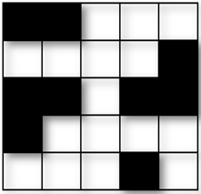
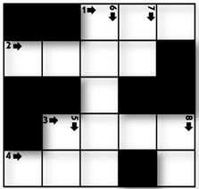
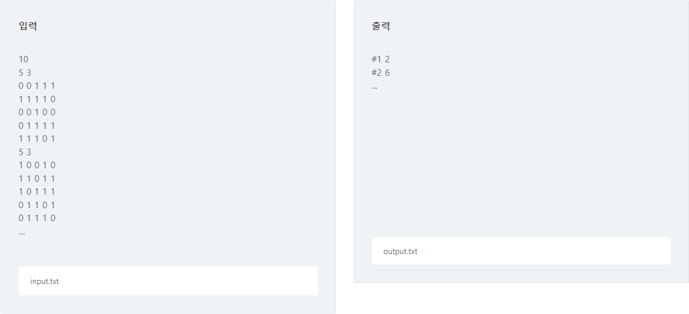

문제 출처
[SWEA_1979_어디에 단어가 들어갈 수 있을까](https://swexpertacademy.com/main/code/problem/problemDetail.do?contestProbId=AV5PuPq6AaQDFAUq).

### **※ SW Expert 아카데미의 문제를 무단 복제하는 것을 금지합니다.**

N X N 크기의 단어 퍼즐을 만들려고 한다. 입력으로 단어 퍼즐의 모양이 주어진다.

주어진 퍼즐 모양에서 특정 길이 K를 갖는 단어가 들어갈 수 있는 자리의 수를 출력하는 프로그램을 작성하라.

## [예제]

N = 5, K = 3 이고, 퍼즐의 모양이 아래 그림과 같이 주어졌을 때
 

길이가 3 인 단어가 들어갈 수 있는 자리는 2 곳(가로 1번, 가로 4번)이 된다.
 

## [제약 사항]

1. N은 5 이상 15 이하의 정수이다. (5 ≤ N ≤ 15)

2. K는 2 이상 N 이하의 정수이다. (2 ≤ K ≤ N)

## [입력]

입력은 첫 줄에 총 테스트 케이스의 개수 T가 온다.

다음 줄부터 각 테스트 케이스가 주어진다.

테스트 케이스의 첫 번째 줄에는 단어 퍼즐의 가로, 세로 길이 N 과, 단어의 길이 K 가 주어진다.

테스트 케이스의 두 번째 줄부터 퍼즐의 모양이 2차원 정보로 주어진다.

퍼즐의 각 셀 중, 흰색 부분은 1, 검은색 부분은 0 으로 주어진다.

## [출력]

테스트 케이스 t에 대한 결과는 “#t”을 찍고, 한 칸 띄고, 정답을 출력한다.

(t는 테스트 케이스의 번호를 의미하며 1부터 시작한다.)

