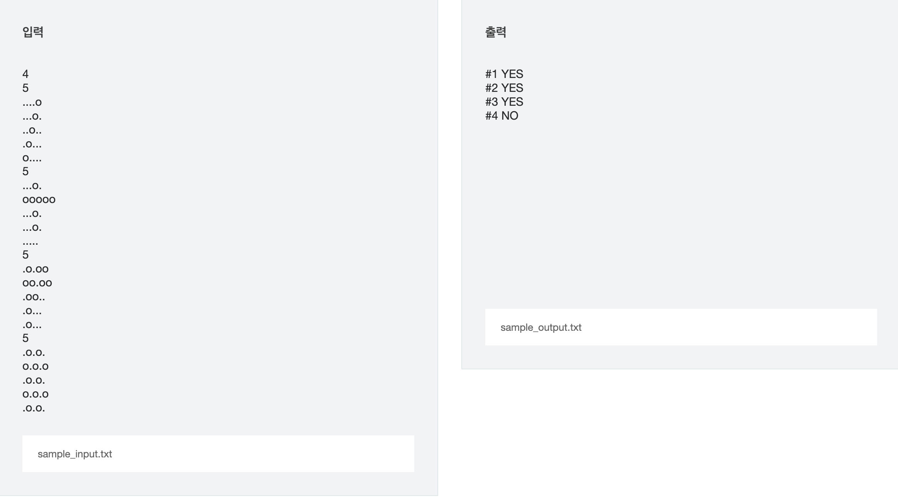

문제 출처
[SWEA_11315_오목판정](https://swexpertacademy.com/main/code/problem/problemDetail.do?contestProbId=AXaSUPYqPYMDFASQ)

### **※ SW Expert 아카데미의 문제를 무단 복제하는 것을 금지합니다.**

N X N 크기의 판이 있다. 판의 각 칸에는 돌이 있거나 없을 수 있다. 돌이 가로, 세로, 대각선 중 하나의 방향으로 다섯 개 이상 연속한 부분이 있는지 없는지 판정하는 프로그램을 작성하라.

  

## [입력]

첫 번째 줄에 테스트 케이스의 수 T가 주어진다.

각 테스트 케이스의 첫 번째 줄에는 하나의 정수 N(5 ≤ N ≤ 20)이 주어진다.

다음 N개의 줄의 각 줄에는 길이 N인 문자열이 주어진다. 각 문자는 ‘o’또는 ‘.’으로, ‘o’는 돌이 있는 칸을 의미하고, ‘.’는 돌이 없는 칸을 의미한다.

  

## [출력]

각 테스트 케이스 마다 돌이 다섯 개 이상 연속한 부분이 있으면 “YES”를, 아니면 “NO”를 출력한다.

