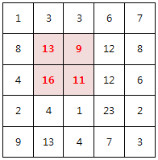
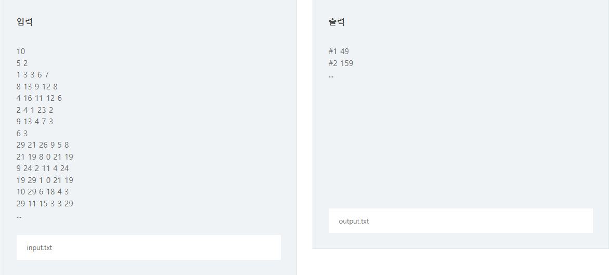

문제 출처
[SWEA_2001_파리퇴치](https://swexpertacademy.com/main/code/problem/problemDetail.do?contestProbId=AV5PzOCKAigDFAUq).

### **※ SW Expert 아카데미의 문제를 무단 복제하는 것을 금지합니다.**

N x N 배열 안의 숫자는 해당 영역에 존재하는 파리의 개수를 의미한다.

아래는 N=5 의 예이다.
 

M x M 크기의 파리채를 한 번 내리쳐 최대한 많은 파리를 죽이고자 한다.

죽은 파리의 개수를 구하라!

예를 들어 M=2 일 경우 위 예제의 정답은 49마리가 된다.
 

## [제약 사항]

1. N 은 5 이상 15 이하이다.

2. M은 2 이상 N 이하이다.

3. 각 영역의 파리 갯수는 30 이하 이다.

## [입력]

가장 첫 줄에는 테스트 케이스의 개수 T가 주어지고, 그 아래로 각 테스트 케이스가 주어진다.

각 테스트 케이스의 첫 번째 줄에 N 과 M 이 주어지고,

다음 N 줄에 걸쳐 N x N 배열이 주어진다.

## [출력]

출력의 각 줄은 '#t'로 시작하고, 공백을 한 칸 둔 다음 정답을 출력한다.

(t는 테스트 케이스의 번호를 의미하며 1부터 시작한다.)

