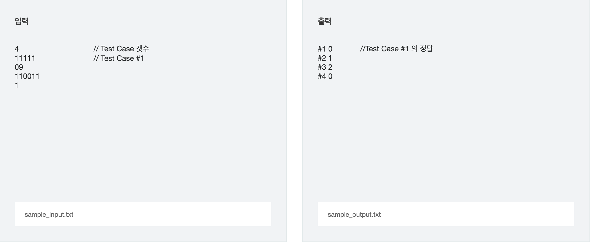

문제 출처
[SWEA_4789_성공적인 공연 기획](https://swexpertacademy.com/main/code/problem/problemDetail.do?contestProbId=AWS2dSgKA8MDFAVT)

### **※ SW Expert 아카데미의 문제를 무단 복제하는 것을 금지합니다.**

동욱이는 공연을 기획하고 있다. 이번이 그가 처음으로 기획한 공연이기 때문에, 성공에 매우 민감하여 반드시 공연을 성공시키겠다는 집념으로 불타고 있다.

동욱이는 이런 집착 중 하나로 공연이 끝난 후 모든 사람들의 기립 박수를 받고 싶다.

사람들은 공연이 끝난 후 모두 기립 박수를 할 생각이 있지만 기립 박수를 시작하는 타이밍은 사람마다 다를 수 있다.

이는 사람들이 가진 각자의 부끄러움 때문인데, 지금 기립 박수를 하고 있는 사람의 수가 특정한 수 이상이 되면 그제서야 일어나서 기립 박수를 하게 되는 것이다.

이 특정한 수를 넘지 않으면 절대로 기립 박수를 하지 않는다.

그렇기에 우선 아무런 조건이 없이 기립 박수를 하는 사람들이 기립 박수를 시작하고, 그것을 본 다른 사람들이 또 일어나서 연쇄적으로 기립 박수를 하게 된다.

그리고 조건을 만족하지 못한 사람들은 부끄러움에 계속해서 앉아있게 된다.

그래서 동욱이는 먼저 공연의 표를 예약한 사람들의 정보를 개개인에 대해 모두 조사하여, 각 사람들이 기립 박수를 하려면 최소 몇 명의 사람들이 기립 박수를 하고 있어야 하는지를 알게 되었다.

각 사람들의 조건이 모두 다르기 때문에, 구성이 어떤 지에 따라 몇몇의 사람은 기립 박수를 하지 않을 수도 있다.

그래서 몇 명의 사람들을 고용하여 공연이 끝난 후 기립 박수를 바로 하게 하여 실제로 표를 사서 공연을 관람한 사람들이 모두 기립 박수를 하도록 하게 하고 싶다.

최소 몇 명의 사람들을 따로 고용해야 할까?

## [입력]

첫 번째 줄에 테스트 케이스의 수 T가 주어진다.

각 테스트 케이스의 첫 번째 줄에는 ‘0’에서 ‘9’사이의 문자 만으로 이루어진 문자열이 주어진다. 이 문자열의 길이는 1001 이하이다.

이 문자열의 첫 번째 글자가 의미하는 바는 기립 박수를 하고 있는 사람이 아무도 없을 때(0 명일 때) 기립 박수를 하는 사람의 수를 의미한다.

그리고 i번째 글자가 의미하는 바는 기립 박수를 하고 있는 사람이 i-1명 이상일 때 기립 박수를 하는 사람의 수를 의미한다.

가장 마지막 문자는 ‘0’이 아니다. (적어도 한 명의 관객이 있음을 의미한다.)

## [출력]

각 줄마다 "#T" (T는 테스트 케이스 번호)를 출력한 뒤, 모든 관객이 기립 박수를 하게 하려면 최소 몇 명의 사람을 고용해야 하는지 출력한다.

## [예시]

세번째 Test Case를 예로 들어보자. 입력이 110011이다.

기립 박수 치는 사람이 아무도 없을 때 먼저 1명이 박수를 치기 시작한다. 그리고 1명이 뒤따라서 박수를 치기 시작한다.

그 다음으로 박수를 칠 사람은 현재 박수 치는 사람이 4명 이상일 때만 박수를 치므로 이 사람을 박수치게 만드려면 2명이 더 필요하다.

그래서 이 시점에서 2명을 더 고용하면 총 5명이 박수를 치게 된다. 그 다음으로 박수를 칠 사람은 5명 이상일 때에만 박수를 치는데 현재 5명이 박수를 치고 있으므로 마찬가지로 박수를 칠 것이다.

모든 사람이 박수를 치게 되었으므로 동욱이가 고용해야 될 사람은 2명이 된다.

