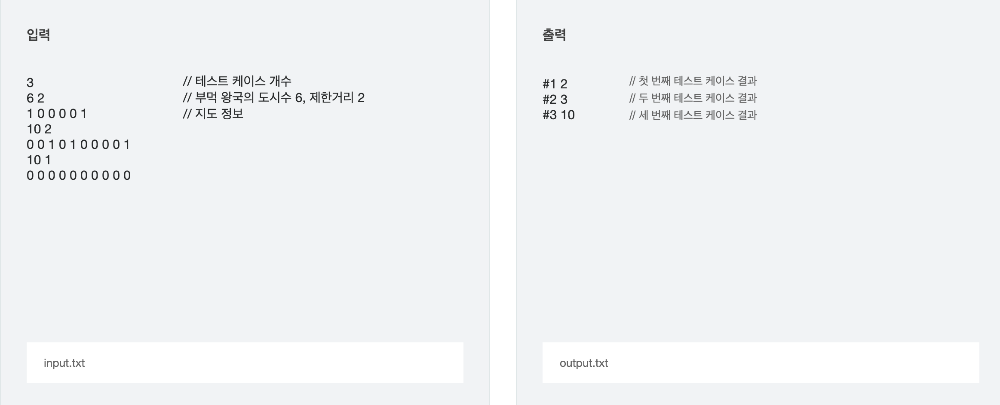

문제 출처
[SWEA_7964_부먹왕국의차원관문](https://swexpertacademy.com/main/code/problem/problemDetail.do?contestProbId=AWuSgKpqmooDFASy)

### **※ SW Expert 아카데미의 문제를 무단 복제하는 것을 금지합니다.**

부먹 왕국은 찍먹 무리에게 침략을 당했었다.

하지만 탕수육의 힘으로 성공적으로 막아 내었으나 도시의 많은 차원관문이 파괴당했다.

부먹 왕국의 특징은 모든 도시들을 건설 할 때 일렬로 이어지게 만들었다.

어느 도시에 차원 관문을 설치하면 그 도시와 거리 D 이하인 다른 도시에서 차원 관문이 있는 곳으로 들어오거나, 혹은 차원 관문에서 거리 D 이하인 다른 도시로 나가는것이 가능하다.

찍먹 왕국의 재침공에 대비하기 위해서 모든 도시 이동이 되어야하며 모든 차원 관문 사이와 직접적으로 이동이 가능하도록 차원 관문을 재건하려고 한다.
(단, 0번 위치와 N+1번 위치에는 차원 관문이 존재 한다.)

가능한 빠른 건설을 위하여 최소 개수로 설치하는 계획을 세우려고 할때

도시들마다 차원관문이 남아있는 지에 대한 정보가 주어졌을 때, 이동에 필요한 차원관문의 최소 개수를 구하여라.

## [입력]

첫 번째 줄에 테스트 케이스의 수 T가 주어진다.

각 테스트 케이스의 첫 번째 줄에는 부먹 왕국의 도시 수 N(1 ≤ N ≤ 300,000)과 이동 제한 거리 D(1 ≤ D ≤ N)이 주어진다.

두 번째 줄에는 1번 도시부터 차례대로 각 도시에 차원관문이 남아있는 지에 대한 정보가 주어진다.

1은 남아있음을 의미하며 0은 파괴 당한 것을 의미한다.

i번 도시와 (i+1)번 도시 사이의 거리는 모든 1 ≤ i < N에 대해서 1이다.

## [출력]

각 테스트 케이스마다 ‘#x’(x는 테스트케이스 번호를 의미하며 1부터 시작한다)를 출력하고,

각 테스트 케이스마다 부먹 왕국이 추가로 건설 해야 하는 차원관문 의 최소 개수를 구하여라.

