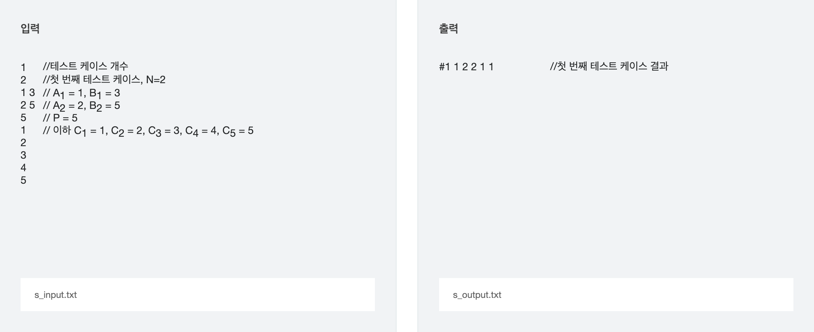

문제 출처
[SWEA_6485_삼성시의버스노선](https://swexpertacademy.com/main/code/problem/problemDetail.do?contestProbId=AWczm7QaACgDFAWn)

### **※ SW Expert 아카데미의 문제를 무단 복제하는 것을 금지합니다.**

삼성시에 있는 5,000개의 버스 정류장은 관리의 편의를 위해 1에서 5,000까지 번호가 붙어 있다.

그리고 버스 노선은 N개가 있는데, i번째 버스 노선은 번호가 Ai이상이고,

Bi이하인 모든 정류장만을 다니는 버스 노선이다.

P개의 버스 정류장에 대해 각 정류장에 몇 개의 버스 노선이 다니는지 구하는 프로그램을 작성하라.

## [입력]

첫 번째 줄에 테스트 케이스의 수 T가 주어진다.

각 테스트 케이스의 첫 번째 줄에는 하나의 정수 N ( 1 ≤ N ≤ 500 )이 주어진다.

다음 N개의 줄의 i번째 줄에는 두 정수 Ai, Bi ( 1 ≤ Ai ≤ Bi ≤ 5,000 )가 공백 하나로 구분되어 주어진다.

다음 줄에는 하나의 정수 P ( 1 ≤ P ≤ 500 )가 주어진다.

다음 P개의 줄의 j번째 줄에는 하나의 정수 Cj ( 1 ≤ Cj ≤ 5,000 ) 가 주어진다.

## [출력]

각 테스트 케이스마다 ‘#x’(x는 테스트케이스 번호를 의미하며 1부터 시작한다)를 출력하고 한 칸을 띄운 후,

한 줄에 P개의 정수를 공백 하나로 구분하여 출력한다.

j번째 정수는 Cj번 버스 정류장을 지나는 버스 노선의 개수여야 한다.

