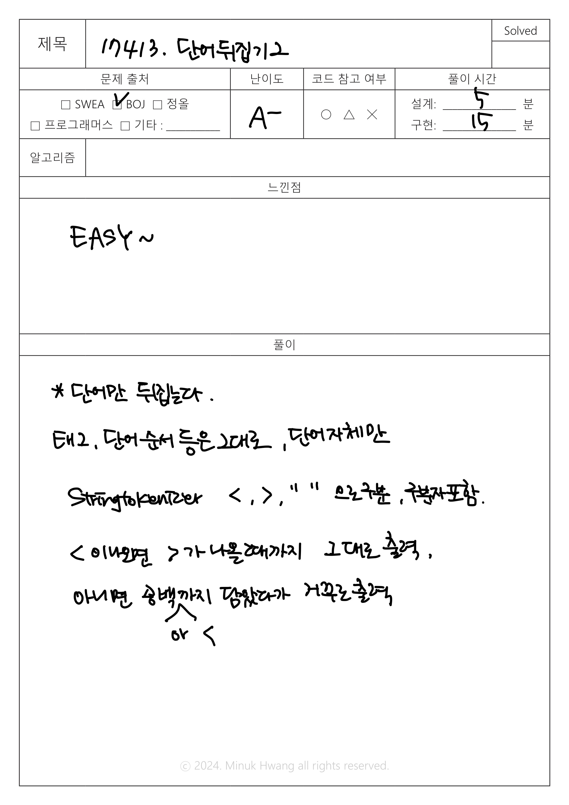

문제 출처
[BOJ_17413_단어뒤집기2](https://www.acmicpc.net/problem/17413)

## 문제
문자열 S가 주어졌을 때, 이 문자열에서 단어만 뒤집으려고 한다.

먼저, 문자열 S는 아래와과 같은 규칙을 지킨다.

1. 알파벳 소문자('a'-'z'), 숫자('0'-'9'), 공백(' '), 특수 문자('<', '>')로만 이루어져 있다.
2. 문자열의 시작과 끝은 공백이 아니다.
3. '<'와 '>'가 문자열에 있는 경우 번갈아가면서 등장하며, '<'이 먼저 등장한다. 또, 두 문자의 개수는 같다.

태그는 '<'로 시작해서 '>'로 끝나는 길이가 3 이상인 부분 문자열이고, '<'와 '>' 사이에는 알파벳 소문자와 공백만 있다. 단어는 알파벳 소문자와 숫자로 이루어진 부분 문자열이고, 연속하는 두 단어는 공백 하나로 구분한다. 태그는 단어가 아니며, 태그와 단어 사이에는 공백이 없다.

## 입력
첫째 줄에 문자열 S가 주어진다. S의 길이는 100,000 이하이다.

## 출력
첫째 줄에 문자열 S의 단어를 뒤집어서 출력한다.

