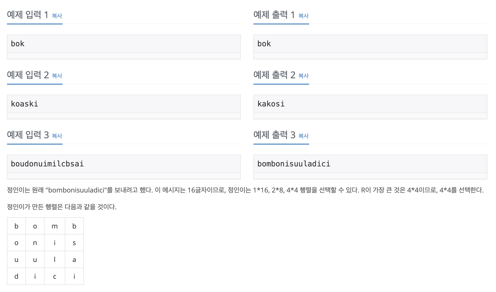

문제 출처
[BOJ_2999_비밀 이메일](https://www.acmicpc.net/problem/2999)

## 문제
매일 밤, 정인이는 상근이에게 이메일을 보낸다. 정인이는 자신의 이메일이 해킹당할 수도 있다는 생각에, 내용을 항상 암호화해서 보낸다.

정인이가 사용하는 암호 알고리즘은 다음과 같다. 정인이가 보내는 메시지는 총 N글자이다.

먼저, 정인이는 R<=C이고, R*C=N인 R과 C를 고른다. 만약, 그러한 경우가 여러 개일 경우, R이 큰 값을 선택한다.

그 다음, 행이 R개고, 열이 C개인 행렬을 만든다.

이제 메시지를 행렬에 옮긴다. 첫 번째 행의 첫 번째 열부터 C번째 열까지 메시지를 순서대로 옮긴 뒤, 남은 메시지는 두 번째 행, 세 번째 행,... R번째 행에 첫 번째 행을 채운 방법과 동일한 순서대로 옮긴다.

행렬에 모두 메시지를 옮겼다면, 이 것을 첫 번째 열의 첫 번째 행부터 R번째 행까지 차례대로 읽으면서 다시 받아 적는다. 그 다음에, 두 번째 열, 세 번째 열,..., C번째 열에 쓰여 있는 문자를 첫 번째 열을 읽은 방법과 동일하게 받아적는다.

상근이는 매일 밤 정인이의 메시지를 해독하는데 지쳤다. 정인이의 암호 이메일이 주어졌을 때, 이를 해독하는 프로그램을 작성하시오.

## 입력
첫째 줄에 상근이가 받은 메시지가 주어진다. 이 메시지는 알파벳 소문자로만 이루어져 있고, 최대 100글자이다.

## 출력
첫째 줄에 상근이가 받은 메시지를 해독한 메시지를 출력한다.

